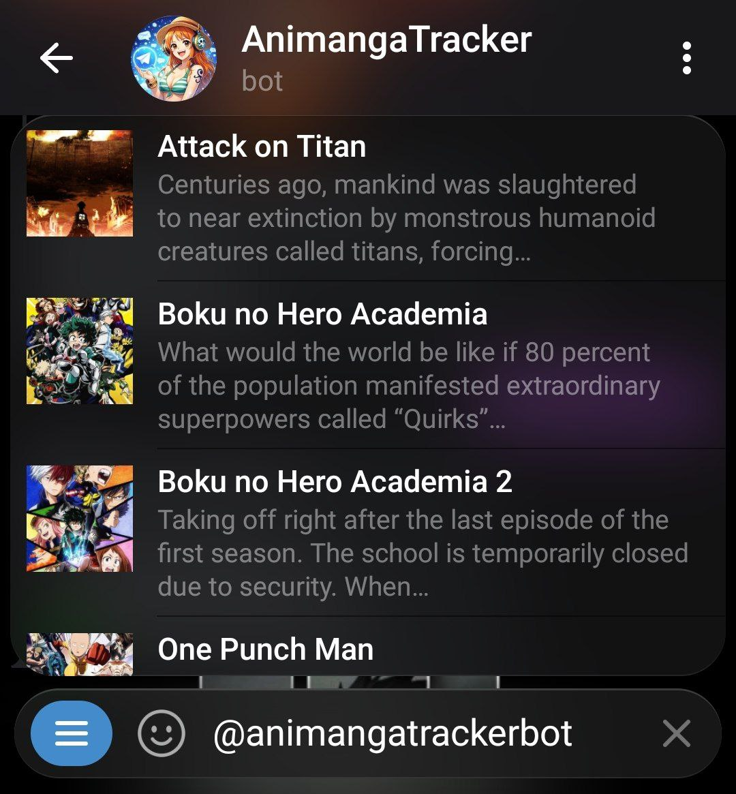
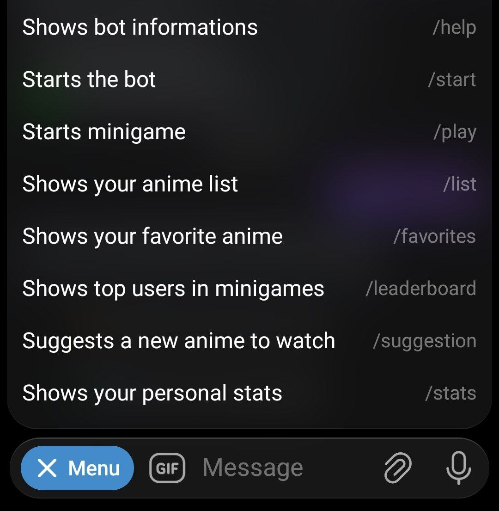
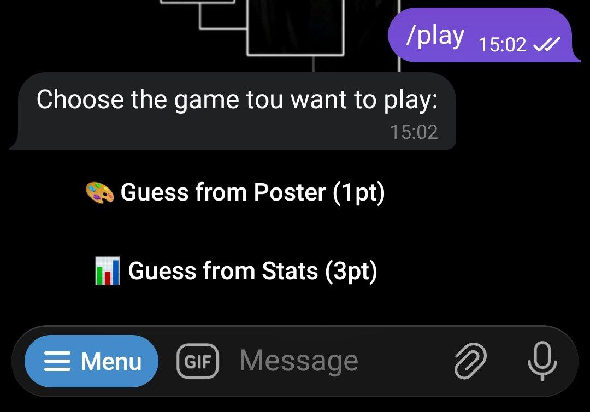
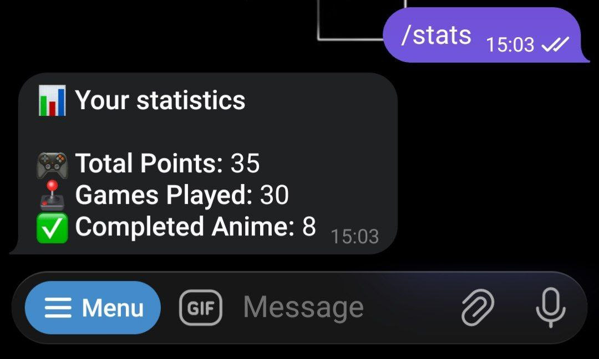

# 🤖 Anime Tracker Bot – Telegram

Anime Tracker Bot è un bot Telegram che consente agli utenti di tenere traccia
degli anime già visti, di quelli attualmente in visione e di quelli che
desiderano guardare in futuro.

Inoltre, il bot include un sistema di minigiochi a tema anime che permette
di testare le proprie conoscenze e competere con altri utenti tramite
una classifica globale.

------------------------------------------------------------
DESCRIZIONE DEL PROGETTO
------------------------------------------------------------

Il progetto consiste in un bot Telegram che integra funzionalità di:
- gestione personale di una lista anime
- consultazione di informazioni sugli anime
- suggerimenti per la watchlist
- statistiche personali
- minigiochi competitivi

Il bot utilizza un database locale per salvare i dati e una API
esterna per il recupero delle informazioni sugli anime.

------------------------------------------------------------
API UTILIZZATA
------------------------------------------------------------

Per il recupero delle informazioni sugli anime viene utilizzata l'API Kitsu,
che fornisce dati completi come titolo, descrizione, generi, stato e rating.

Documentazione ufficiale API Kitsu:
https://kitsu.docs.apiary.io

------------------------------------------------------------
SETUP E INSTALLAZIONE
------------------------------------------------------------

Requisiti:
- Java (versione compatibile con il progetto)
- Database SQLite
- Account Telegram
- Token di un bot Telegram (ottenibile tramite BotFather)

------------------------------------------------------------
CONFIGURAZIONE BOT TELEGRAM
------------------------------------------------------------

All'interno della cartella resources è presente un file di esempio:
config.properties.example

Copiare il file e rinominarlo in:
config.properties

Inserire al suo interno il token del bot Telegram nel seguente formato:
BOT_TOKEN=INSERISCI_QUI_IL_TOKEN

------------------------------------------------------------
SETUP DATABASE
------------------------------------------------------------

Per inizializzare il database è necessario utilizzare il file:
database_example.sql

Il file contiene la struttura completa di tutte le tabelle richieste
dal progetto e le relative relazioni.

Creare un database vuoto e inserire le tabelle fornite.

Relazioni:
- N a N tra Anime e Utenti
- N a N tra Giochi e Utenti

------------------------------------------------------------
UTILIZZO DEL BOT
------------------------------------------------------------

Comandi disponibili:

- /start        -> Avvia il bot
- /help         -> Mostra la lista dei comandi disponibili
- /list         -> Mostra la propria lista anime
- /play         -> Avvia un minigioco
- /leaderboard  -> Mostra la classifica globale dei minigiochi
- /suggestion   -> Suggerisce un anime da guardare
- /stats        -> Mostra le statistiche personali

------------------------------------------------------------
RICERCA INLINE
------------------------------------------------------------

Il bot supporta la ricerca inline di Telegram.
È possibile cercare un anime direttamente dalla chat digitando:

@NomeDelBot nome_anime

I risultati vengono recuperati dinamicamente tramite l'API Kitsu.

------------------------------------------------------------
STATISTICHE DISPONIBILI
------------------------------------------------------------

Alcuni esempi di statistiche fornite dal bot:

- Numero totale di anime completati
- Miglior punteggio nei minigiochi
- Partite giocate

------------------------------------------------------------
SCREENSHOT ED ESEMPI
------------------------------------------------------------

- Esempio di ricerca inline

- Esempio dei comandi del bot

- Esempio dei minigiochi

- Esempio delle statistiche

